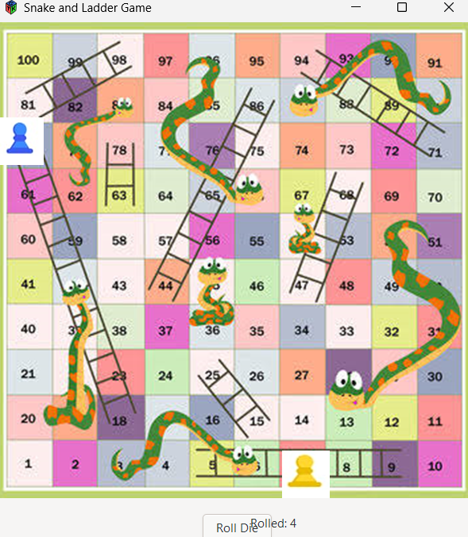
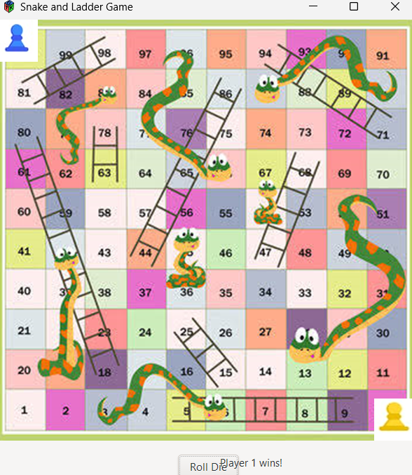
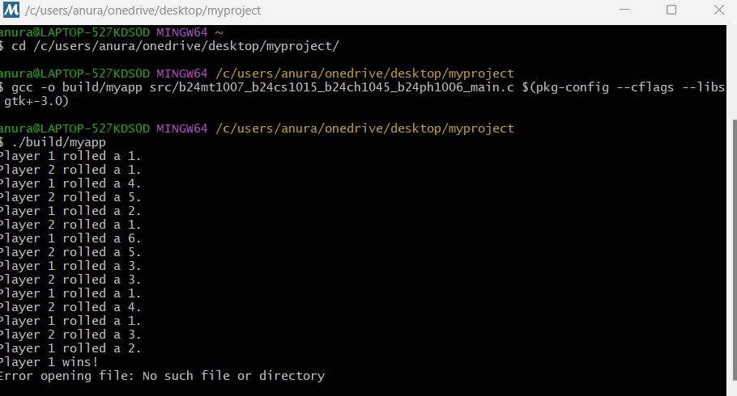

# Snakes and Ladders Game

A graphical implementation of the classic Snakes and Ladders board game developed in C using the GTK GUI toolkit. The game supports two-player gameplay, dynamic dice rolls, score tracking, and an interactive graphical interface.

## Features

* Two-player turn-based gameplay
* Interactive graphical user interface built with GTK
* Random dice roll generation
* Snakes and ladders mechanics
* Persistent score tracking using file handling
* Win detection and score updates
* Visual player movement across the board

## Technologies Used

* C Programming Language
* GTK (GIMP Toolkit)
* GCC Compiler
* File Handling in C

## Game Rules

1. Two players start from position 1.
2. Players take turns rolling a six-sided die.
3. The player moves forward according to the die value.
4. Landing on a ladder advances the player upward.
5. Landing on a snake moves the player downward.
6. The first player to reach square 100 wins the game.

## Project Structure

```text
Snakes-And-Ladders/
│
├── main.c
├── score.txt
├── board.png
├── p1.png
├── p2.png
└── README.md
```

## Screenshots





## Installation

### Linux

```bash
gcc -o snakes_and_ladders main.c `pkg-config --cflags --libs gtk+-3.0`
./snakes_and_ladders
```

### Windows

1. Install GTK.
2. Install GCC (MinGW/MSYS2).
3. Compile the project.
4. Run the generated executable.

## Learning Outcomes

Through this project, I gained experience in:

* GUI development using GTK
* Event-driven programming
* File handling in C
* Random number generation
* Game logic implementation
* Collaborative software development

## Future Improvements

* Sound effects
* Animations for player movement
* Improved graphics
* Online multiplayer support
* Multiple difficulty levels

## Authors

* Anurag Pawar
* Arpit
* T. Manisha Beniwal
* Ayaan Tanweer
